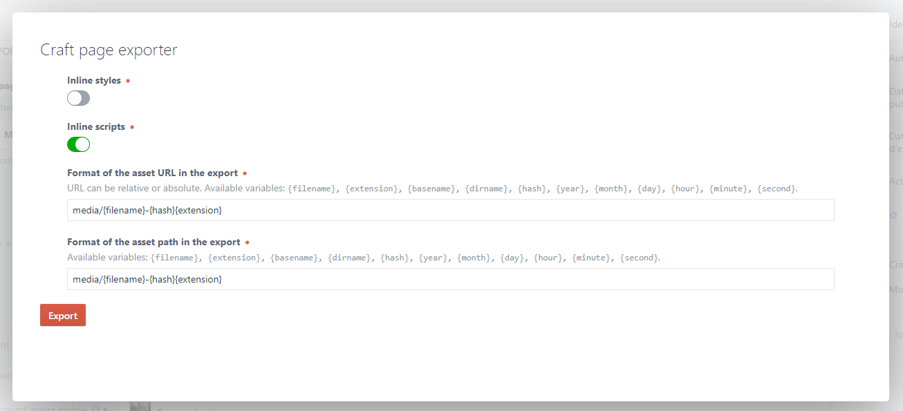
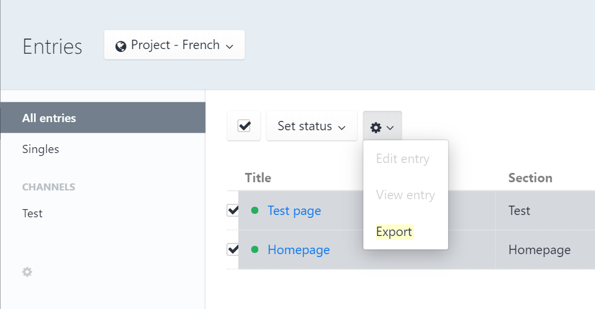

# Craft Page Exporter

This plugin allows you to export entries in ZIP format from the control panel.
The resulting archive contains a static HTML rendering of the entry along with
its images, videos, scripts and styles.



Example of resulting archive:
````
export.zip
├── page-name-1-en.html
├── page-name-2-en.html
└── media
    ├── styles.5875592d.css
    ├── scripts.8b5a78f2.js
    ├── image-1.808162ef.jpg
    ├── logo.5b4d3420.svg
    ├── my-font.9a212477.woff
    └── ...
````


## Requirements

This plugin requires Craft CMS 3.0.0-RC1 or later.


## Installation

You can install this plugin from the Plugin Store or with Composer.

#### From the Plugin Store

Go to the Plugin Store in your project’s Control Panel and search for
“Page exporter”. Then click on the “Install” button in its modal window.

#### With Composer

Open your terminal and run the following commands:

````bash
# go to the project directory
cd /path/to/my-project

# tell Composer to load the plugin
composer require la-haute-societe/craft-page-exporter

# tell Craft to install the plugin
./craft plugin/install craft-page-exporter
````

## Usage

Select one or more entries from `admin/entries`, then select `Export` from the
context menu.

You can also export a single entry from its edit page.



## Configuration

You can configure the plugin's behavior from the plugin settings page.
Or, for more options, from the configuration file
`config/craft-page-exporter.php`.

Example of (simple) configuration file :
````php
<?php

return [
    'inlineStyles'      => true,
    'inlineScripts'     => true,
    'exportPathFormat'  => 'media/{filename}-{hash}{extension}',
    'exportUrlFormat'   => 'media/{filename}-{hash}{extension}',
];
````


### Configuration settings

The configuration file can contain the following settings:


#### `inlineStyles`
*Default: `true`*

Whether external stylesheets must be inlined in the main HTML page inside a
`style` tag.

If `true`, external stylesheets content will be moved inside a `<style>` tags.

If `false`, external stylesheets will be left in external files.


#### `inlineScripts`
*Default: `true`*

Whether external scripts must be inlined in the main HTML page inside a `script`
tag.

If `true`, external scripts content will be moved inside a `<script>` tags.

If `false`, external scripts will be left in external files.


#### `exportPathFormat`
*Default: `{dirname}/{basename}`*

Format of the asset path in the ZIP archive.
This path is relative to the root of the archive.

It's possible:
  - to keep the structure of the original folders: `{dirname}/{basename}`
  - to put all assets in a single folder: `media/{filename}{extension}`<br>
    In that case it's recommended to add a hash in the file name to avoid any
    filename collision: `media/{filename}-{hash}{extension}`

The following variables are available:

| Variables       | Values                                            |
| --------------- | ------------------------------------------------- |
| `{filename}`    | `filename`                                        |
| `{extension}`   | `.png` (the dot is already contains in the value) |
| `{basename}`    | `filename.png`                                    |
| `{dirname}`     | `/path/to/folder`                                 |
| `{hash}`        | `c023d66f` (hash of the file content)             |
| `{year}`        | `date('Y')`                                       |
| `{month}`       | `date('m')`                                       |
| `{day}`         | `date('d')`                                       |
| `{hour}`        | `date('H')`                                       |
| `{minute}`      | `date('i')`                                       |
| `{second}`      | `date('s')`                                       |

You can also use any Twig expression like:

````twig
my-folder/{{ "now"|date("Y-m") }}/{{ hash[:1] }}/{{ hash[1:1] }}/{hash}/{{ filename|upper }}{extension}
````

which will create this path:

`\my-folder\2019-05\1\8\18f4a488\MY-IMAGE.png`


#### `exportUrlFormat`
*Default: `{dirname}/{basename}`*

Format of the asset URL in the ZIP archive.

In most cases, this path should correspond to the `exportPathFormat` setting.

This parameter accepts the same variables as `exportPathFormat`.

If you plan to place your assets on a CDN for example, you can specify an
absolute URL :
````https://my.cdn.example.com/xyz/{dirname}/{basename}````


#### `archiveFilename`
*Default: `export`*

Filename of the ZIP archive.


#### `assetTransformers`
*Default: `[]`*

Collection of transformers that can be used to modify the content or path of
assets.

For example, to add a comment at the beginning of an HTML file:

````php
return [
    // ...
    'assetTransformers' => [
        function (lhs\craftpageexporter\models\Asset $asset) {
            // Target only HTML asset
            if (!($asset instanceof lhs\craftpageexporter\models\HtmlAsset)) {
                return;
            }

            $content = $asset->getContent();

            $user = Craft::$app->getUser()->getIdentity();
            $manifest = '<!-- Page generated on ' . date('Y-m-d H:i:s') . ' by ' . $user->username . ' -->';
            $content = $manifest . PHP_EOL . $content;

            $asset->setContent($content);
        },
    ]
];
````

If you modify content of child assets you should call the method
`$asset->updateInitiatorContent()` after updating the asset in order to forward
the update to his parent.


#### `customSelectors`
Child assets are found thanks to
[XPath expressions](http://xmlfr.org/w3c/TR/xpath/).

If you want to add asset to the ZIP archive with custom XPath, for something
like:

````twig
<tag whatever="{{ myImageUrl }}"></tag>
````

you can add selectors like that:

````php
return [
    // ...
    'customSelectors' => [
       [
         'selectors'  => [
             '//tag/@whatever',
          ],
          'assetClass' => lhs\craftpageexporter\models\MiscAsset::class,
       ]
    ],
];
````

 - `selectors`: collection of XPath expression
 - `assetClass`: one of the following `Asset` class:
    - `ImageAsset`: external image(s) URL
    - `InlineStyleAsset`: inline stylesheet
    - `StyleAsset`: external stylesheet URL
    - `ScriptAsset`: external script URL
    - `MiscAsset`: any type of external asset URL (video, audio...)


#### `sourcePathTransformer`
*Default: `null`*

Function used to transform the absolute url of assets to file path.<br>
If not set, paths are defined like that:

````php
return [
    // ...
    'sourcePathTransformer' => function (lhs\craftpageexporter\models\Asset $asset) {
        return str_replace(
            UrlHelper::baseRequestUrl(),
            Yii::getAlias('@webroot/'),
            $asset->getAbsoluteUrl()
        );
    },
];
````

> By default, if asset file is not found, its content will be empty.
> No error is displayed.


#### `entryContentExtractor`
*Default: `null`*

If not set, the content of entries is generated with th Craft method
`Controller::renderTemplate()`. <br>
You can define a custom callback function which return HTML content from entry:

 ````php
 return [
     // ...
    'entryContentExtractor' => function (\craft\elements\Entry $entry) {
        return file_get_contents($entry->initialAbsoluteUrl);
    },
 ];
 ````


#### `failOnFileNotFound`
*Default: `false`*

If `true` an exception will be thrown if an asset file is not found.<br>
Otherwise, no error is displayed and an empty file will be created in the
archive.


## Register assets explicitly

If some assets cannot be targeted by an XPath expression, for example if you
need to generate a JSON containing URLs, you can explicitly register assets
from the twig template:

````twig


<script>
    const myObject = {{ object|json_encode|raw }};
    console.log(myObject);
</script>
````


## Licensing

This plugin is free to try in development environments, but requires payment to
be used in production environments. The license fee for this plugin is $29
(license + one year of updates) via the Craft Plugin Store, then $5 per year
for updates (optional).

Brought to you by
<br>
<a href="https://www.lahautesociete.com" target="_blank"></a>
